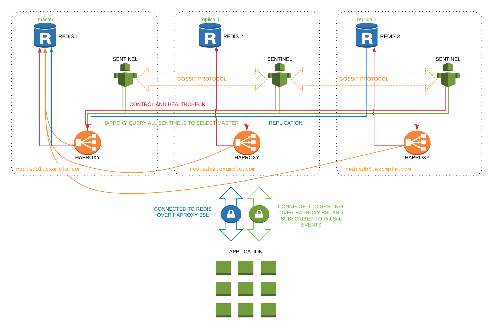
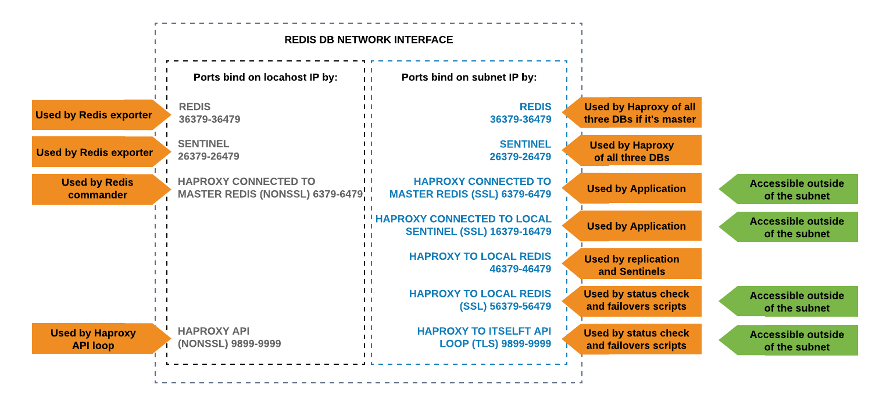
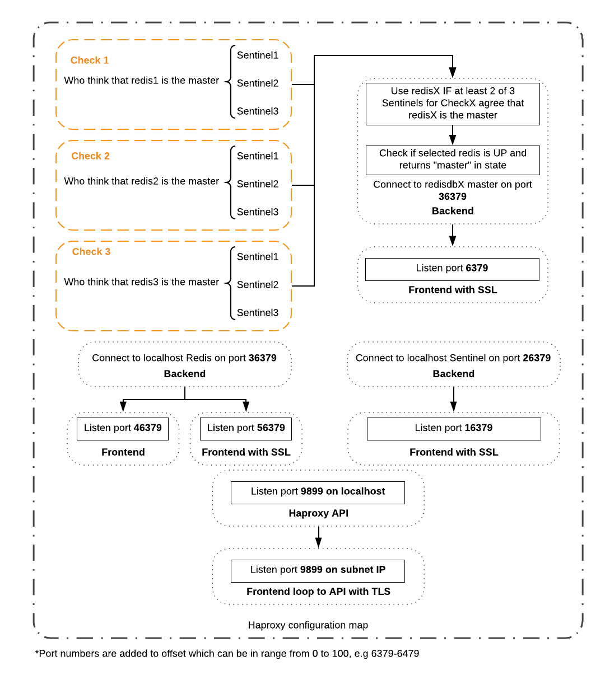

# HA Redis
Ansible role with highly available Redis cluster. Can be used when you need more than just caching servers and you care about every value stored in Redis.

## Why we made it?
According to official [Redis doc](https://redis.io/topics/cluster-spec)
> Redis Cluster uses asynchronous replication between nodes, and last failover wins implicit merge function. This means that the last elected master dataset eventually replaces all the other replicas. There is **always a window of time when it is possible to lose writes during partitions**.

and there are many more cases when you can lose data, so this is what we trying to avoid. This role successfully used in production with zero downtime for many months

## Features
* TLS Encryption from the application to Redis/Sentinel
* Highly available database with no data loss during a crash, no chance for split brain
* 100% uptime, can upgrade and perform maintenance with no scheduled downtime windows
* Useful scripts to make failover without downtime and data loss, get status about the cluster and run custom commands
* Manual failover is designed to be performed in less than 2 seconds
* Sentinel configured to trigger failover after 5 seconds of master timeout. Usually, the whole process takes up to 7 seconds
* One of two Redis replicas can be stopped with no effect cluster functionality

## Encryption
In this repo vars file with passwords and certificate key are stored in clear text but that's ok only for an example. To secure passwords we use [Ansible Vault](https://docs.ansible.com/ansible/latest/user_guide/vault.html). To enable it you need to encrypt `vars/main.yml` and create `~/.ssh/.vault_pass.txt` file in Ansible host

## Requirements
* Python 3
* Ansible role must be executed within the private networks, like AWS VPC. Running it from the laptop over hosts with external IP's won't work (and generally speaking, it's a bad idea to have database instances with public access)
* You must have your own SSL certificate key/crt pair and add crt on your ansible host `/etc/ssl/certs/ca-certificates.crt`

## Setup
* Configure domain, ip's and other stettings in `tasks/config.yml`
* Update inventory file `hosts` with your db instance names
* Run `ansible-playbook -i hosts site.yml`

## FAQ
* What clients are you using to make Sentinels/Redis connections encrypted with TLS?
  - Java (our PR) https://github.com/xetorthio/jedis/pull/2139
  - Go https://github.com/go-redis/redis
  - Python (support TLS out of the box) https://pypi.org/project/redis
* What if I can't use sentinel aware driver?
  - Thanks to HA-Proxy you will always be routed to master, no matter what instance you are connected to. You just need to figure out how to reconnect your client to another instance if the first one is gone.
* So what exactly you have done to prevent network partitioning (aka split-brain)?
  - Redis configured to be a replica of itself by default, this way it will always be read-only after the restart
  - We added `min-slaves-to-write 1` which force master to have at least one alive replicate to allow writes, otherwise, it becomes read-only
  - HA-Proxy has special health check which is asking sentinels about current master health
* There are clusters and subclusters in configuration, what are they used for?
  - Horizontal scaling is not a trivial task for DB's. One cluster is a set of 3 instances. Because of the quorum, you can't simply add one more instance. Let say we have one cluster which is growing so at one point it won't fit into existing set of instances. With subclusters, we can easily move DB to a new set of instances without downtime at all.

## Network diagram

## Haproxy port mapping

*PLEASE NOTE: "Accessible outside of the subnet" green mark on the right means that in our case it's not restricted by firewall, but you are welcome to use it as you need*
## Haproxy configuration diagram

